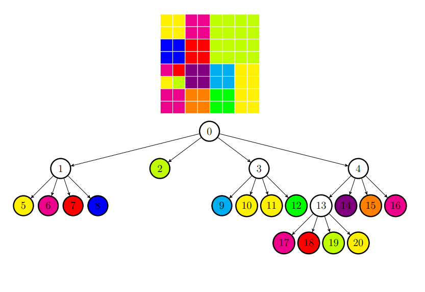

# 1 Image compression

## 1.1 Quadtree

<div style = "text-align: justify;">For a quadtree, the root represents a square and the descendants represents
the four disjoint and congruent squares, into which the original square can be divided.
The child zones are disjoint, and their union forms the parent zone.
So, the quadtree is a tree in which each
non-terminal node will have 4 fixed descendants.</div>

## 1.2 The compression algorithm

<div style = "text-align: justify;">Any square image, of dimension power of 2, can be represented by a
quadtree. The nodes on each level of the tree correspond to a division of one
square areas in the image in four quarters. The root of the tree is associated with the entire image,
the nodes on the first level of the tree correspond to the four quarters of the image (the order
is: top left, top right, bottom right, bottom left), the nodes on the second level correspond to
quarters of each previous quarter and so on. The division of the image can continue until
the nodes of the current level of the tree correspond to uniform square areas: if the region
considered square is not uniform, then it will be decomposed, by cutting, into four equal parts, 
and the corresponding node will become non-terminal, having four descendants. If the region is
considered to be uniform (composed of identical pixels), the respective node becomes a leaf node (terminal) of the tree. Each terminal node contains information corresponding to the value
the image area to which it is associated.</div>
<br>
<p align="center">
  
</p>

# 2 Image decompression

<div style = "text-align: justify;">To restore the initial image from the tree representation, only choice terminal nodes whose value corresponds to the object pixels. The depth at which a leaf is placed in the tree contains the size of the corresponding square area from the
image. The position of the leaf to the nodes on the same level that have the same predecessor is directly
determined by the rule for allocating quarters of an area to the descending nodes of the tree
(the assignment rule must be preserved for the entire tree).</div><br>

# 3 Files format

<div style = "text-align: justify;">We will use color images. For the representation of color images there are
several formats available. Regardless of the format, for a color image we will have stored a
pixel array where each pixel of the image consists three numerical values,
called color channels: red, green and blue <b>(RGB)</b>. These values ​​are used to
describe the amount of color specific to each pixel. Each channel can have a contained value
between 0 and 255, where 0 represents no color and 255 represents the maximum amount of color
possible in a certain channel. By combining the values ​​from the three channels, it is obtained a
wide range of colors, which allows for a wide variety of color images.
For simplicity, we have chosen to use the <b>.PPM</b> format.</div>

## 3.1 .PPM File

<div style = "text-align: justify;">A file in <b>.PPM</b> format has a header, in text format, which includes: on the first line
the file type (in this case of the images used, it will be the <b>P6</b> type), on the second line two natural numbers
(<b>width</b> and <b>height</b>), separated by space, which describe the dimensions of the image, and a
third line which contains a natural number representing the maximum value that a color can take (in this case, the value is <b>255</b>); and the image itself, in binary format.</div><br>

### 3.1.1 The image itself

<div style = "text-align: justify;">This section is represented by a matrix of pixels containing the largest
part of the file. The number of elements in the matrix is equal to the product of the number of pixels
per line (<b>width</b>) and the number of pixels per column (<b>height</b>), the matrix being organized on lines and
columns, starting with the top line of the image, the leftmost pixel.</div>

Additional information about this format and some examples can be found at:<br>
http://paulbourke.net/dataformats/ppm/.

## 3.2 Compressed file

The compressed file will contain the results of the compression process:

<ul>
    <li><b>image_size</b> - <b>unsigned int type</b> - which specifies the size
    of the image (remember that we have square images);</li>
    <li>For each node in the breadth first traversal applied to the compression tree we will
    write in the file the following informations:</li>
    <ol>
        <li>If the node is an internal node:</li>
            <ul>
                <li><b><i>node__type</i></b> - <b>unsigned char type</b> – which will have the value 0 in this
            case.</li>
            </ul>
        <li>If the node is a leaf node:
        <ul>
            <li><b><i>node__type</i></b> - <b>unsigned char type</b> – which will have the value 1 in this
            case;</li>
            <li><b><i>value__of__red</i></b> - <b>unsigned char type</b> – which will indicate the value
            the component responsible for the Red color for the pixels in the area described by
            that node;</li>
            <li><b><i>value__of__green</i></b> - <b>unsigned char type</b> – which will indicate the value
            the component responsible for the Green color for the pixels in the area described by
            that node;</li>
            <li><b><i>value__of__blue</i></b> - <b>unsigned char type</b> – which will indicate
            the value of the component responsible for the Blue color for the pixels in the area
            described by that node.</li>
            </li>
        </ul>
    </ol>
</ul>
To better understand how a node's descendant will appear, we propose
            the following graphic representation of such a division in which the 4 nodes are also evident
            child.<br>
            
<p align="center">
  
</p>

The decompressed file is a standard file in <b>.PPM</b> format and contains the information
extracted from the file, the compressed file given for decompression.

# 4 Options

## 4.1 Option 1

<div style = "text-align: justify;">First, we'll build the compression tree.
We will read the image from the file, the PPM file, and then we will build the
compression tree for it.
To determine when a block that can be represented in the tree has been reached
quaternary compression as a leaf node, in other words, it no longer needs to be divided into
other 4 areas of equal size, the average color of the block will be calculated, determining for
each channel (<b>RED</b>, <b>GREEN</b> and <b>BLUE</b>) the arithmetic mean of the values ​​in the pixel subarray
which corresponds to the block. We will consider this subarray to start with the found element
at coordinates (<i>x</i>, <i>y</i>), where <i>x</i> represents the line index and <i>y</i> represents the column index. We know that any analyzed submatrix must be quadratic and we will consider it to be
dimension <i>size</i> × <i>size</i>.
To calculate the arithmetic mean of the values ​​in the corresponding pixel subarray
to a certain block we will be able to use the following formulas:

<p align="center">
  
</p>

After the mean color has been determined, a similarity score is computed for the current block, using the following formula:

<p align="center">
  
</p>

where <i>red</i>, <i>green</i>, <i>blue</i> represent the components for the average color.
If the obtained value for the score is less than or equal to the imposed factor, then
there will be no need for division.
After we have built the compression tree, we want to determine the following informations:

<ul>
    <li>the number of levels in the quadtree;</li>
    <li>the number of blocks in the image for which the pixel similarity score is higher
    less than or equal to the supplied factor;</li>
    <li>the size of the side of the square for the largest area in the image that
    remained undivided.</li>
</ul>

<b>This information will be written in the file, each text on one line. The file name is
supplied as an argument in the command line.</b></div>

## 4.2 Option 2

<div style = "text-align: justify;">The compression of an image in the format must be done
<b>PPM</b>, using the compression algorithm detailed in the previous section of the statement.
After this compression tree is built, it is breadth first traversal and is generated
the compression file, according to the format described in <a href="#32-compressed-file"> Section 3.2</a>.</div>

## 4.3 Option 3

<div style = "text-align: justify;">The initial image must be reconstructed, starting from one
file resulting from compression and using the described decompression algorithm.
The rebuild process starts from the traversal
available in the compressed file, and to generate the image based on the tree. The binary file will have the format described in <a href="#32-compressed-file"> Section 3.2</a>.</div>

## 5 Example

<p align="center">
  
</p>

<p align="center">
  
</p>

## 5.1 Option 1

<div style = "text-align: justify;">We will assume that each square in the previous image has size <i>4 × 4</i>. The number of
levels in the compression tree is 4, the number of blocks in the image for which the similarity score of the pixels is less than or equal to the provided factor is 16, and the square which
describes the largest area in the image that remained undivided has side size 16.<br>
<b>quadtree.out:</b><br>
4<br>
16<br>
16</div>

## 5.2 Option 2

<div style = "text-align: justify;">After reading the image and creating its quadtree, we can perform the compression of
the image. For this, we will apply the breadth first traversal algorithm to the quadtree.
The order in which the nodes of the tree appear in the breadth first traversal result
is as follows:

<p align="center">
  
</p>

For the tree above, these are the values ​​we will write into the binary file for each
level:

<p align="center">
  
</p>

In this representation, I specified the level index at the beginning and then the values. To make it easier to follow, we have delimited by <b>{</b> and <b>}</b> the 4 values ​​for the leaf nodes
(<b>node\_\_type, red, green, blue</b>).

Starting from the next picture, we will see how the given factor affects the quadtree
and, by default, the compression operation.</div>

<p align="center">
  <br>
  <i>Figure 1</i>: The Initial image
</p>

<p style="text-align: center">
    1. If the given factor is 0, then the compression tree will be this:
    <p align="center">
        
    </p>
    <p align="center">
        For this quadtree, the image after decompression will look like this:<br>
        <br>
        <i>Figure 2</i>: Image with factor 0
    </p>
    <p align="center">
        2. If the given factor is higher, then the compression tree might look like
        this. Each leaf node will account for the average color of the block.<br>
        
    </p>
    <p align="center">
        For this quadtree, the image would look like this: <br>
        <br>
        <i>Figure 3</i>: Image with a bigger factor
    </p>
</p>

## 5.3 Option 3

<div style = "text-align: justify;">You will have to read the binary file that represents the compression of
an image. In this file are the informations necessary for the construction of the quadtree
associated with the image.</div>

# 6 Deatils about implementation

## 6.1 Option 1

<div style = "text-align: justify;">For this requirement, I've started by reading from the binary file given as an argument, in this order:

<ul>
    <li>~the format of the binary file;</li> 
    <li>~two values ​​representing the width and height (size) of the image;</li>
    <li>~the maximum value that a color can take;</li>
    <li>~the end of the line;</li> 
    <li>to then read <i>size</i> x <i>size</i> x 3 unsigned char values, representing in order, <b>red</b>, <b>green</b>, <b>blue</b>, and add them to a <b>RGB</b> pixel type matrix.</li> 
</ul>
After I finished reading the binary file, I've called the function 'divideQuadtree', which recursively builds the quadtree.
This function basically traverses the pixel matrix from the coordinates received as a parameter to the coordinates + the specified dimension and calculates according to the formulas the similarity score of the pixels in that block. (the coordinates received as a parameter in the main function represent the coordinates of the already created and allocated pixel matrix, start_x -> 0, start_y ->0, end_x -> size, end_y -> size). If the similarity score is less than or equal to the compression factor provided as a parameter, then the function is called recursively for all 4 children of the current (internal) node, again dividing the same square by 4, according to the formulas found:

```
(node1: start_x -> same as before, start_y -> same as before, end_x -> mean of start_x + end_x, end_y -> mean of start_y + end_y)
(node2: start_x -> same as before, start_y -> mean of start_y + end_y, end_x -> mean of start_x + end_x, end_y -> same as before)
(node3: start_x -> start_x + (end_x - start_x) / 2, start_y -> start_y + (end_y - start_y) / 2, end_x -> same as before, end_y -> same as before)
(node4: start_x -> start_x + (end_x - start_x) / 2, start_y -> same as before, end_x -> same as before, end_y -> start_y + (end_y - start_y) / 2)
```

If the score is lower, then it means that the node is a leaf (external) and the RGB (red, green, blue) values ​​found earlier are added to it by the formulas provided. Finally, that cell is returned.
I had to display the number of levels (a simple recursive function), the number of blocks in the image for which the similarity score of the pixels is less than or equal to the provided factor, the number of leaves (a recursive function that checks if the children are NULL and adds to the sum) and the side size of the square for the largest area in the image that remained unsplit, the size halved by n times (n := the level on which the nearest leaf is of root). Finally, I have freed memory for all allocated structures and the pixel array and closed the files.</div>

## 6.2 Option 2

<div style = "text-align: justify;">For this option I used the same approach as in option 1, but without displaying those properties of the created quadtree. Therefore, to traverse the tree by levels (or width) and write the information about the tree to the binary file, we needed a queue with the quadtree nodes.
The first time I allocate an internal tree cell and add it to the queue (!only the POINTER to the node is added to the queue). As long as my queue is not empty, I extract one node (POINTER) from the queue and check its type. If it's a leaf type (external), I display 1 (the specific type for the leaf) and the RGB values ​​(red, green, blue), and if the type is internal (0), then I just write the type to the file. If the nodes are not leaves, then I also insert the children into the queue. Thus, through this recursive algorithm, I managed to display in the proposed format, the compressed tree traversed by levels, passing through all its nodes. (or in width)</div>

## 6.3 Option 3

<div style = "text-align: justify;">For this option I read from the newly created file in option 2 the image size and compressed tree traversal and started to rebuild it. For this I used the reverse procedure of option 2, I read the first node, and if it is of leaf type (external), I also read the RGB values ​​(red, green, blue) and built the tree (because if the first node is leaf type, it means it's a solid image of the same color, with only one node), but if the first node is internal type (0), then I add it to the queue and start the same process as in option 2, extract one at a time node in the queue (pointer), and if it is 0, I read 4 more nodes, which I also check if they are of type internal or external (0 or 1) and add them to the queue. This aglorithm rebuilds the compressed tree as long as the queue is not empty.
Further, I wrote in the binary file the specific format:

<ul>
    <li>~the format of the binary file;</li>
    <li>~two values ​​representing the width and height (size) of the image;</li>
    <li>~the maximum value that a color can take;</li>
    <li>~the end of the line.</li>
</ul>
    I allocated an array of RGB (red, green, blue) pixels the size of the image and start reconstructing the array based on the compressed quadtree, depth traversing it. The only difference from option 1 is that here I no longer calculate a similarity score, because I put the same color for each child in a square of size - size / 2, with the start and end coordinates found in option 1. Basically I write in the RGB pixel array and change it to in-memory squares based on half the size for each child.
At the end I go through the matrix and display in order all the pixels (width x height x 3) unsigned char values ​​representing red, green, blue for each pixel in the matrix.</div>

# 7 Restrictions and specifications

<div style = "text-align: justify;">In order to make sure the program will work, you will need to type:

```
make
```

in your terminal to compile all of the .c files.

(you can view make rules in the <b>Makefile</b>)

Your program will receive as arguments in the command line, the filename of the input file and output file, and an option, in the following way:

```
./quadtree [-c1 factor | -c2 factor | -d] [input__file__name] [output__file__name]
```

<ul>
    <li> <b><i>-c1 factor</i></b> for solving option 1 (factor = threshold for the compression);</li>
    <li> <b><i>-c2 factor</i></b> for solving option 2 (factor = threshold for the compression);</li>
    <li> <b><i>-d</i></b> for option 3;</li>
    <li> <b><i>input__file__name </b></i> represents the name of the input file (the one that contains the
    image);</li>
    <li> <b><i>output__file__name </b></i> represents the name of the output file, in which it will be written, according to
    the command received, the result of the program.</li>
</ul>

If you want to try this program, you can use images from <i>tests/</i> folder.
Just type:

```
    make
    // for option 1
    ./quadtree -c1 [factor] tests/input/test"$1".ppm tests/output/test.out
    // compare result with tests/ref/test"$i"_c1.txt

    make
    // for option 2
    ./quadtree -c2 [factor] tests/input/test"$i".ppm tests/output/test.out
    // compare result with tests/ref/test"$i"_c2.out

    make
    // for option 2
    ./quadtree -d tests/input/test"$i"_c2.out tests/output/test.ppm
    // compare result with tests/ref/test"$i"_c3.ppm
```

where you can replace "$i" with the number of the image you are testing.

</div>
